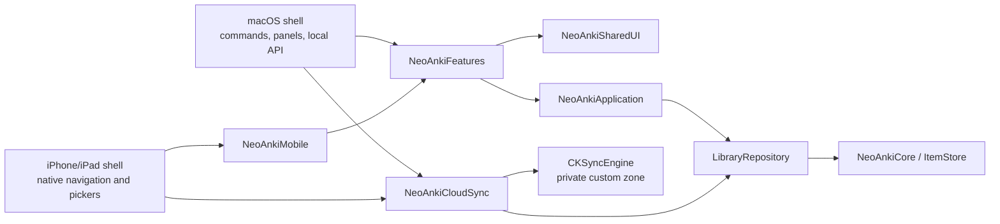
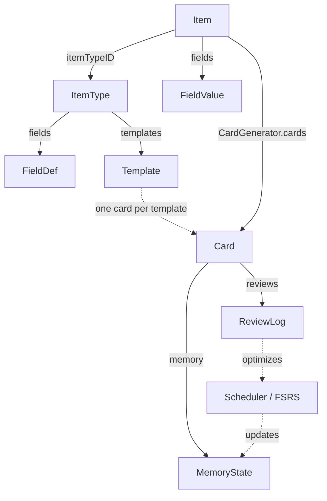

# NeoAnki2 — Architecture

A native macOS, iPhone, and iPad spaced-repetition app (Swift 6 / SwiftUI) with
domain logic in the standalone `NeoAnkiCore` package and platform-neutral
workflows in `NeoAnkiFeatures`.

## System overview and migration status

NeoAnki is a universal Apple-platform product. The domain remains one package;
platform-neutral observable workflows sit behind explicit repository and service
boundaries, and each application target is a thin composition root.



The dependency rule is inward-only. `NeoAnkiApplication` cannot import SwiftUI,
AppKit, UIKit, or CloudKit. `NeoAnkiSharedUI` cannot import AppKit, UIKit, or
CloudKit. `NeoAnkiCloudSync` cannot import UI frameworks. The executable target
is the composition root and the only place where Mac commands, AppKit adapters,
and the local HTTP server are assembled.

| Target | Owns now | Must not own |
| --- | --- | --- |
| `NeoAnkiCore` | Domain values, schema validation, persistence, scheduling, study-response and content-visibility semantics | UI copy, navigation, pickers, CloudKit |
| `NeoAnkiApplication` | Repository capabilities, `AppSession`, routes, presentations, editor/draft state, service protocols, sync-facing types | SwiftUI/AppKit/UIKit/CloudKit |
| `NeoAnkiFeatures` | Observable library, authoring, study, transfer, reminder, widget, and sync workflows shared by app shells | AppKit/UIKit/CloudKit and direct SQLite access |
| `NeoAnkiMobile` | Adaptive SwiftUI screens and iOS media/playback adapters | App identity, entitlements, CloudKit credentials |
| `NeoAnkiSharedUI` | Adaptive reading layout, semantic tokens, common status/empty/error content | File panels, Mac tables, menu commands, database access |
| `NeoAnkiCloudSync` | CKSyncEngine transport, separate engine metadata, merge/conflict policy | Domain-table ownership, blocking startup, UI |
| `NeoAnkiDeckBuilderCore` | Generator descriptors, workspaces, generated bundles | SwiftUI type erasure |
| `NeoAnkiDeckBuilderKit` | `AnyView` feature registry | Generator or persistence rules |
| `NeoAnki2` | macOS composition, AppKit adapters, commands, and local API | Mobile-only services and new reusable business rules |

### Extraction matrix

| Area | Shared | Platform adapted | macOS only |
| --- | --- | --- | --- |
| Home, study, item detail, common forms | Feature content and state | Compact/regular containers and safe-area footers | Window composition |
| Browse | Query, filtering, selection | iPhone `List`; iPad adaptive table/list | Mac `Table` pagination |
| Library navigation | Deck tree and rows | stack vs split navigation | menu/keyboard routing |
| Editors and media | Drafts, validation, semantic rendering | rich text, cloze, image/GIF, audio adapters | AppKit text editors and panels |
| Import/export | transfer state and validated workflows | document-picker/security-scope adapter | `NSOpenPanel`/`NSSavePanel`, local API |

The Xcode-managed `NeoAnkiiOS` target contains only lifecycle composition,
capabilities, and device services. The `NeoAnki2Widget` extension reads a
privacy-limited App Group snapshot; it never opens the domain database and never
receives prompts or answers.

### Offline-first synchronization

SQLite remains authoritative and fully usable offline or when the iCloud account
is unavailable. `NeoAnkiCloudSync` uses the private database, container
`iCloud.com.neoanki2.app`, and fixed zone `NeoAnkiLibrary`. Engine state, device
identity, outbound cursor, inbound staging, and issues are stored in a separate
metadata file, not in domain tables.

Review events and reverts are immutable union members. Mutable conflicts accept
the server record while preserving the local version as a `SyncConflictCopy`;
delete-versus-edit follows the same preservation rule. A non-blocking Sync Issues
screen surfaces those copies. Remote domain application must run through validated
repository transactions with echo suppression; transport code never mutates
SQLite directly.

The first merge backs up SQLite, unions local and cloud records, keeps the device's
existing identity canonical while recording cloud identities as aliases, deduplicates
item types by canonical schema digest, deterministically remaps cross-library identifier
collisions, and uploads the preserved result. Validated remote domain batches commit in
one SQLite transaction; staged assets and the verified pre-merge backup remain available
for recovery if a transfer fails.

See [ADR 0001](adr/0001-shared-application-and-ui-layers.md),
[ADR 0002](adr/0002-cloudkit-offline-first-sync.md), and
[ADR 0003](adr/0003-application-library-boundary.md).

### iOS release gates

- Automated gates: package tests, architecture validation, generic iOS app and
  widget builds, UI journeys, accessibility configurations, and an unsigned
  Release archive validation.
- External Apple gates: signed two-device CloudKit testing and TestFlight upload.
  These require the Apple team, production CloudKit schema, push environment,
  App Group, and provisioning profiles described in `IOS_RELEASE.md`.

---

## 1. Domain principles

- **Native-only.** Card content is data, not documents: every renderable value is
  a `ContentValue` case drawn by SwiftUI. No HTML, no CSS, no template language,
  nothing to sanitize. Styling is semantic (`Span.Style`: `.bold`, `.highlight`,
  `.code`, …), not visual markup.
- **No Anki interop.** No `.apkg`/`.colpkg`, no shared-deck import, no `{{Field}}`
  templates. A clean schema is chosen over a migration path.
- **Generic and domain-neutral.** The core knows no subject. Fields, item types,
  and templates are user-declared data. The app offers a neutral `Basic` schema
  as a first-run convenience, not as protected domain logic: starter seeding is
  recorded once per library, `Basic` is user-deletable, and it is never
  recreated after deletion. Core clients may configure an empty starter set.

  | Domain    | Example item type                | Example generated cards                            |
  | --------- | -------------------------------- | -------------------------------------------------- |
  | Anatomy   | Bone (name, region, image)       | image → recall name; name → locate                 |
  | Music     | Interval (name, audio, notation) | audio → name interval; notation → reproduce        |
  | Chemistry | Element (symbol, name, number)   | symbol → name; name → atomic number                |
  | Geography | Country (name, map, capital)     | map → name; name → capital                         |

  **Acceptance test:** deleting a subject (its items and item type) must require
  no change to any Swift type, enum case, or scheduler. If it does, the design has
  leaked domain knowledge and is wrong. The flow suite exercises this with a
  novel spatial/sequence arrange-and-reproduce schema through creation, card
  generation, study, and deletion.
- **Grounded in learning science.** Every structural decision maps to a finding
  in §2.

---

## 2. Learning-Science Foundations

| Principle | Structural decision |
| --- | --- |
| **Testing effect** | Knowledge (`Item`) is separated from its tests (`Card`s); one item spawns many independent retrieval events. |
| **Encoding specificity** | `Skill = input Modality × output Modality × Operation`; each card trains one explicit route. |
| **Desirable difficulties (Bjork)** | `Interaction` (`.reveal`, `.type`, `.choose`, `.record`, `.cloze`, `.arrange`) dials the effort a card demands. |
| **Dual coding** | Media is a first-class `ContentValue` (`.media(MediaRef)`), not an attachment on text. |
| **Atomicity / minimum information** | Cards are per-template probes; an item fans out into many atomic cards. |
| **Interleaving** | Scheduling operates on the flat pool of due cards; `Deck`s are organizational only. |
| **Modern scheduling (FSRS / DSR)** | `MemoryState` exposes `stability`/`difficulty`; the `Scheduler` protocol is implemented by FSRS. |

---

## 3. Architecture: Three Layers

*What you know*, *how it is shown and tested*, and *how it is remembered* never
bleed into each other.

```
Layer 1 — CONTENT (domain-neutral, native)
  ContentValue, Span, ClozeSpan, MediaRef

Layer 2 — SCHEMA / PRESENTATION (user-declared)
  ItemType → [FieldDef], [Template]
  Template → prompt/answer Side → [Slot(SlotSource + Presentation)]
  Interaction, SlotCondition, Skill

Layer 3 — MEMORY / SCHEDULING (algorithm-agnostic)
  MemoryState behind Scheduler protocol; ReviewRating 1–4; ReviewLog; FSRS
```

### Layer 1 — Content

```swift
public enum ContentValue: Codable, Equatable, Sendable {
    case text(String, lang: String? = nil)
    case rich([Span])          // semantic spans, not markup
    case media(MediaRef)       // audio, image, gif, video
    case cloze(String, blanks: [ClozeSpan])
    case number(Double)
    case empty
}
```

`MediaRef` is a serializable handle into a content-addressed store (`MediaStore`:
SHA-256 hash, files under `{AppSupport}/neoanki2/media/`). Legacy URL-based refs
are rejected during decoding; only validated hash references resolve. Content
carries no presentation, so the same value can appear differently on prompt vs.
answer via `Presentation` on each `Slot`.

### Layer 2 — Schema / Presentation

```swift
public struct ItemType { var name: String; var fields: [FieldDef]; var templates: [Template] }

public struct Template {
    var prompt: Side                 // what the learner sees first
    var answer: Side                 // what is revealed / checked
    var interaction: Interaction     // how the learner responds
    var skill: Skill                 // the cognitive route trained
    var generateWhen: SlotCondition? // optional gate on generation
}

public struct Skill { var input: Modality; var output: Modality; var operation: Operation }
// Modality:  text, audio, image, video, diagram, none, freeResponse, selection, spatial, sequence
// Operation: recognize, recall, discriminate, classify, locate, order, apply, explain, reproduce
```

A `Side` is an ordered list of `Slot`s; each `Slot` pairs a `SlotSource`
(`.field(UUID)` or `.literal(String)`) with a `Presentation` (`RevealMode` +
`MediaBehavior`).

Item-type visibility is separate from schema identity. `library_item_types`
marks ordinary reusable Item Types. `deck_included_item_types` associates
imported definitions with an imported root, while ordered
`deck_item_type_policy_entries` select the types offered when authoring in a
deck. Policy lookup walks to the nearest ancestor with entries. Thus digest
deduplication can reuse one schema without accidentally changing whether it is
an ordinary type, an included type, or both.

Unlocking a deck-provided type adds its existing identifier to
`library_item_types`; it does not clone or migrate the definition, items, or
deck policies. The included association remains as provenance and prevents
incorrect cleanup. Schema edits separately inspect populated removed or
type-changed fields so the UI can require explicit confirmation.

### Layer 3 — Memory / Scheduling

```swift
public protocol Scheduler: Sendable {
    func schedule(_ state: MemoryState, rating: ReviewRating, now: Date) -> MemoryState
}
```

Cards hold only a `MemoryState`, so the scheduler is swappable without migrating
cards. `ReviewRating` is a 1–4 grade; every review appends a `ReviewLog`.

---

## 4. Data Model Reference

| Entity | Purpose |
| --- | --- |
| `ItemType` | User-declared schema: fields items hold and templates that make cards. |
| `FieldDef` | One named, typed slot (`text`, `richText`, `audio`, `image`, `gif`, `video`, `number`, `cloze`). |
| `Template` | Pure-data recipe turning one item into one card. |
| `Item` | Field values for an item type, plus tags and optional deck. |
| `FieldValue` | One field's `ContentValue`, keyed by `FieldDef` UUID. |
| `Card` | A reviewable probe: one item × one template, plus `MemoryState`. |
| `Deck` | Hierarchical study grouping with an optional daily new-card throttle. |
| `MemoryState` | Per-card memory: `stability`, `difficulty`, `due`, `reps`, `lapses`, `phase`. |
| `ReviewLog` | Append-only record of one review; drives stats and scheduler optimization. |



A `Card` stores only `itemID`, `templateID`, cached `skill`, and memory; content
is resolved from item and template at study time, so cards stay small and in sync
with edits.

### MediaStore

- **Ingest:** copy bytes into `{AppSupport}/neoanki2/media/{sha256}.{ext}`; dedupe by hash.
- **Validation:** MIME/extension allow-list, magic-byte check, per-kind size caps (e.g. audio 20 MB, video 100 MB).
- **Security:** never persist user-supplied absolute `file://` URLs; resolve only inside the sandbox.
- **Schema v7:** `media_assets` tracks hash, kind, byte size, extension, creation time,
  and the number of persisted field references. Item create/edit/delete applies
  reference deltas in the same SQLite transaction as the item write; zero-reference
  assets are removed by sandbox-checked orphan collection.

### Import (JSON / CSV)

Bulk import stats the file and enforces the **5 MB payload-byte limit before any
full read or parse**; its bounded read repeats the cap check. After decoding,
the **10 000-row**, **256-fields-per-row**, and **32 KB UTF-8 per field string**
limits are enforced immediately, before any imported item is persisted.

| Field type | JSON cell shape |
| --- | --- |
| Text-like | string |
| Media | relative path (under import bundle) or base64 object `{ "base64": "…", "altText": "…" }`; kind comes from the field and extension is inferred from validated bytes |
| Cloze | `{ "text": "…", "blanks": [{ "group": 1, "start": 0, "length": 3, "hint": "…" }] }` |

CSV supports text fields only; cloze and media require JSON.

### Deck import

Two full-deck paths share the same validated, atomic persistence plan:

- `.neodeck` is the SQLite portable interchange format for application
  round trips. It preserves item-type provenance and embeds verified media.
- `.neoanki` is import-only JSON Lines source for coding-agent authoring. It
  uses symbolic identifiers, inline cloze markers, explicit item shards, and
  relative media beneath the source bundle.

Both paths validate before mutation, resolve or create item types by canonical
schema digest, allocate fresh deck/item/card IDs, stage media through
reservations, and commit item types, decks, items, cards, and references in one
database transaction. Authored source intentionally carries no scheduling or
portable provenance.

See [`AUTHORED_DECK_FORMAT.md`]({{ '/AUTHORED_DECK_FORMAT/' | relative_url }}) and
[`PORTABLE_DECK_FORMAT.md`]({{ '/PORTABLE_DECK_FORMAT/' | relative_url }}).

### Study resolution

`SideContent.resolvedSlots` yields `ResolvedSlot(value:presentation:)` so renderers honor
`RevealMode` and meaningful `MediaBehavior` values (default controls, autoplay,
play-on-tap, and looping). Reduce Motion suppresses automatic audio, video, and
GIF playback; static images cannot be authored with playback-only behavior.

The macOS shell exposes item-type/template authoring and study as first-class
detail-pane modes. File import is selected from the File menu and configured in
a native import sheet.

---

## 5. Worked Example

A **Capitals** item type — three fields, three templates:

| Field     | Type    | Required |
| --------- | ------- | -------- |
| `Country` | `text`  | yes      |
| `Capital` | `text`  | yes      |
| `Map`     | `image` | no       |

1. **Recognize** — prompt `Country`, reveal `Capital`. `.reveal`, `text → text, recognize`.
2. **Produce** — prompt `Capital`, type `Country`. `.type`, `text → freeResponse, recall`.
3. **Locate** — prompt `Map`, reveal `Country`. `.reveal`, `image → spatial, locate`, `generateWhen = .fieldNotEmpty(mapFieldID)`.

```swift
let cards = CardGenerator.cards(for: item, type: capitalsType)
// with a map  → 3 cards; without a map → 2 (template 3 skipped)
```

One item, up to three atomic cards, each training a distinct `Skill`, scheduled
independently. Adding an `audio` field plus a template yields a listening card
with no change to any core type.

---

## 6. Scheduling

FSRS is the scheduler, behind the `Scheduler` protocol. It models memory with the
**DSR** trio — Difficulty, Stability, Retrievability — and schedules each review
to a target retention. `MemoryState` carries `stability` and `difficulty` as
algorithm-agnostic parameters; `ReviewLog` history feeds FSRS parameter fitting so
the schedule adapts to the individual learner.

Fitting is a policy decision, not a user action. `FSRSOptimizationSchedule`
decides whether accumulated history warrants a new fit from one count of active
review logs against the last attempt, and `ItemStore.optimizeSchedulingIfNeeded`
runs the fit only when it does. The app calls it at the end of a study session
and reports nothing: new weights change future scheduling, which is not a result
the learner asked for or can act on.

---

## 7. Non-Goals

NeoAnki2 will not render HTML/CSS, import or export `.apkg`/`.colpkg`, support
`{{Field}}` interpolation, bake any domain into the schema, or store presentation
inside content. These boundaries keep the model native, generic, and grounded.
