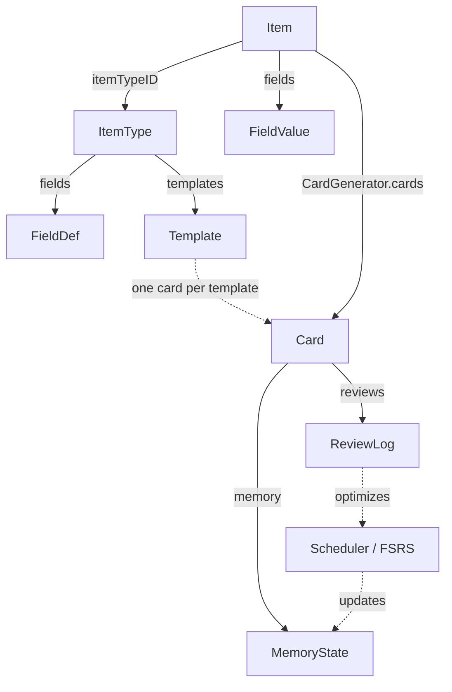

# NeoAnki2 — Design & Philosophy

A native macOS spaced-repetition app (Swift 6 / SwiftUI) with its domain logic in
a standalone package, `NeoAnkiCore`. A ground-up rewrite of the Anki idea, not a
port.

---

## 1. Principles

- **Native-only.** Card content is data, not documents: every renderable value is
  a `ContentValue` case drawn by SwiftUI. No HTML, no CSS, no template language,
  nothing to sanitize. Styling is semantic (`Span.Style`: `.bold`, `.highlight`,
  `.code`, …), not visual markup.
- **No Anki interop.** No `.apkg`/`.colpkg`, no shared-deck import, no `{{Field}}`
  templates. A clean schema is chosen over a migration path.
- **Generic and domain-neutral.** The core knows no subject. Fields, item types,
  and templates are user-declared data.

  | Domain    | Example item type                | Example generated cards                            |
  | --------- | -------------------------------- | -------------------------------------------------- |
  | Anatomy   | Bone (name, region, image)       | image → recall name; name → locate                 |
  | Music     | Interval (name, audio, notation) | audio → name interval; notation → reproduce        |
  | Chemistry | Element (symbol, name, number)   | symbol → name; name → atomic number                |
  | Geography | Country (name, map, capital)     | map → name; name → capital                         |

  **Acceptance test:** deleting a subject (its items and item type) must require
  no change to any Swift type, enum case, or scheduler. If it does, the design has
  leaked domain knowledge and is wrong.
- **Grounded in learning science.** Every structural decision maps to a finding
  in §2.

---

## 2. Learning-Science Foundations

| Principle | Structural decision |
| --- | --- |
| **Testing effect** | Knowledge (`Item`) is separated from its tests (`Card`s); one item spawns many independent retrieval events. |
| **Encoding specificity** | `Skill = input Modality × output Modality × Operation`; each card trains one explicit route. |
| **Desirable difficulties (Bjork)** | `Interaction` (`.reveal`, `.type`, `.choose`, `.record`, `.cloze`, `.arrange`) dials the effort a card demands. |
| **Dual coding** | Media is a first-class `ContentValue` (`.media(MediaRef)`), not an attachment on text. |
| **Atomicity / minimum information** | Cards are per-template probes; an item fans out into many atomic cards. |
| **Interleaving** | Scheduling operates on the flat pool of due cards; `Deck`s are organizational only. |
| **Modern scheduling (FSRS / DSR)** | `MemoryState` exposes `stability`/`difficulty`; the `Scheduler` protocol is implemented by FSRS. |

---

## 3. Architecture: Three Layers

*What you know*, *how it is shown and tested*, and *how it is remembered* never
bleed into each other.

```
Layer 1 — CONTENT (domain-neutral, native)
  ContentValue, Span, ClozeSpan, MediaRef

Layer 2 — SCHEMA / PRESENTATION (user-declared)
  ItemType → [FieldDef], [Template]
  Template → prompt/answer Side → [Slot(SlotSource + Presentation)]
  Interaction, SlotCondition, Skill

Layer 3 — MEMORY / SCHEDULING (algorithm-agnostic)
  MemoryState behind Scheduler protocol; ReviewRating 1–4; ReviewLog; FSRS
```

### Layer 1 — Content

```swift
public enum ContentValue: Codable, Equatable, Sendable {
    case text(String, lang: String? = nil)
    case rich([Span])          // semantic spans, not markup
    case media(MediaRef)       // audio, image, gif, video
    case cloze(String, blanks: [ClozeSpan])
    case number(Double)
    case empty
}
```

`MediaRef` is a serializable handle into a content-addressed store (bytes live
outside the model). Content carries no presentation, so the same value can appear
differently on prompt vs. answer.

### Layer 2 — Schema / Presentation

```swift
public struct ItemType { var name: String; var fields: [FieldDef]; var templates: [Template] }

public struct Template {
    var prompt: Side                 // what the learner sees first
    var answer: Side                 // what is revealed / checked
    var interaction: Interaction     // how the learner responds
    var skill: Skill                 // the cognitive route trained
    var generateWhen: SlotCondition? // optional gate on generation
}

public struct Skill { var input: Modality; var output: Modality; var operation: Operation }
// Modality:  text, audio, image, video, diagram, none, freeResponse, selection, spatial, sequence
// Operation: recognize, recall, discriminate, classify, locate, order, apply, explain, reproduce
```

A `Side` is an ordered list of `Slot`s; each `Slot` pairs a `SlotSource`
(`.field(UUID)` or `.literal(String)`) with a `Presentation` (`RevealMode` +
`MediaBehavior`).

### Layer 3 — Memory / Scheduling

```swift
public protocol Scheduler: Sendable {
    func schedule(_ state: MemoryState, rating: ReviewRating, now: Date) -> MemoryState
}
```

Cards hold only a `MemoryState`, so the scheduler is swappable without migrating
cards. `ReviewRating` is a 1–4 grade; every review appends a `ReviewLog`.

---

## 4. Data Model Reference

| Entity | Purpose |
| --- | --- |
| `ItemType` | User-declared schema: fields items hold and templates that make cards. |
| `FieldDef` | One named, typed slot (`text`, `richText`, `audio`, `image`, `gif`, `video`, `number`). |
| `Template` | Pure-data recipe turning one item into one card. |
| `Item` | Field values for an item type, plus tags and optional deck. |
| `FieldValue` | One field's `ContentValue`, keyed by `FieldDef` UUID. |
| `Card` | A reviewable probe: one item × one template, plus `MemoryState`. |
| `Deck` | Hierarchical study grouping; organization only. |
| `MemoryState` | Per-card memory: `stability`, `difficulty`, `due`, `reps`, `lapses`, `phase`. |
| `ReviewLog` | Append-only record of one review; drives stats and scheduler optimization. |



A `Card` stores only `itemID`, `templateID`, cached `skill`, and memory; content
is resolved from item and template at study time, so cards stay small and in sync
with edits.

---

## 5. Worked Example

A **Capitals** item type — three fields, three templates:

| Field     | Type    | Required |
| --------- | ------- | -------- |
| `Country` | `text`  | yes      |
| `Capital` | `text`  | yes      |
| `Map`     | `image` | no       |

1. **Recognize** — prompt `Country`, reveal `Capital`. `.reveal`, `text → text, recognize`.
2. **Produce** — prompt `Capital`, type `Country`. `.type`, `text → freeResponse, recall`.
3. **Locate** — prompt `Map`, reveal `Country`. `.reveal`, `image → spatial, locate`, `generateWhen = .fieldNotEmpty(mapFieldID)`.

```swift
let cards = CardGenerator.cards(for: item, type: capitalsType)
// with a map  → 3 cards; without a map → 2 (template 3 skipped)
```

One item, up to three atomic cards, each training a distinct `Skill`, scheduled
independently. Adding an `audio` field plus a template yields a listening card
with no change to any core type.

---

## 6. Scheduling

FSRS is the scheduler, behind the `Scheduler` protocol. It models memory with the
**DSR** trio — Difficulty, Stability, Retrievability — and schedules each review
to a target retention. `MemoryState` carries `stability` and `difficulty` as
algorithm-agnostic parameters; `ReviewLog` history feeds FSRS parameter fitting so
the schedule adapts to the individual learner.

---

## 7. Non-Goals

NeoAnki2 will not render HTML/CSS, import or export `.apkg`/`.colpkg`, support
`{{Field}}` interpolation, bake any domain into the schema, or store presentation
inside content. These boundaries keep the model native, generic, and grounded.
